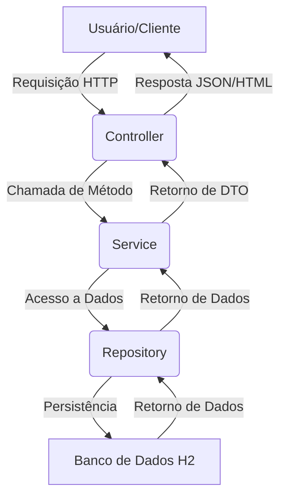
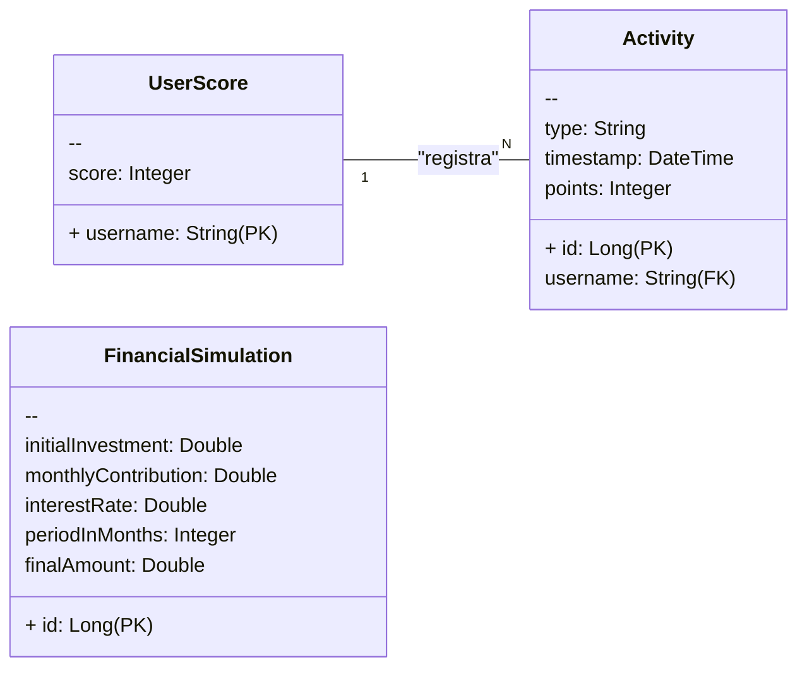

# Projeto de Web Services em Java - Gamificação e Simulação Financeira

Este projeto é uma aplicação **RESTful** desenvolvida com **Spring Boot** que integra um sistema de **gamificação** e uma ferramenta de **simulação de investimentos**. Ele foi estruturado seguindo as melhores práticas de arquitetura de software, com **camadas bem definidas** e o uso de **DTOs** para padronizar a comunicação.

## Sumário

- [1. Estrutura e Tecnologias](#1-estrutura-e-tecnologias)
- [2. Diagramas de Arquitetura](#2-diagramas-de-arquitetura)
  - [2.1 Arquitetura em Camadas (Fluxo de Dados)](#21-arquitetura-em-camadas-fluxo-de-dados)
  - [2.2 Diagrama de Classes e Entidades (UML/ER)](#22-diagrama-de-classes-e-entidades-umler)
- [3. Como Executar o Projeto](#3-como-executar-o-projeto)
  - [Pré-requisitos](#pré-requisitos)
  - [Passos](#passos)
- [4. Exemplos de Requisições da API](#4-exemplos-de-requisições-da-api)
  - [4.1 Simulação Financeira](#41-simulação-financeira)
  - [4.2 Obter a Pontuação de Todos os Usuários](#42-obter-a-pontuação-de-todos-os-usuários)
  - [4.3 Adicionar uma Atividade de Gamificação](#43-adicionar-uma-atividade-de-gamificação)
- [5. Interface Web](#5-interface-web)
- [6. Desenvolvedores](#6-desenvolvedores)

---

## 1. Estrutura e Tecnologias

O projeto utiliza a arquitetura em camadas (**Controller → Service → Repository**) para garantir **separação de responsabilidades** e facilitar manutenção e escalabilidade.

### Tecnologias Principais
- **Linguagem:** Java 17  
- **Framework:** Spring Boot 3  
- **Acesso a Dados:** Spring Data JPA  
- **Banco de Dados:** H2 (em memória, não requer instalação)  
- **Templates:** Thymeleaf para interface web  
- **Utilitários:** Lombok para reduzir código boilerplate  

---

## 2. Diagramas de Arquitetura

### 2.1 Arquitetura em Camadas (Fluxo de Dados)



### 2.2 Diagrama de Classes e Entidades (UML/ER)



---

## 3. Como Executar o Projeto

### Pré-requisitos

- Java 17
- Apache Maven

### Passos

1. Clone o projeto

```bash
git clone <URL_DO_SEU_REPOSITORIO>
```

2. Navegue até a pasta raiz do projeto

```bash
cd <NOME_DO_PROJETO>
```

3. Compile e rode a aplicação

```bash
mvn spring-boot:run
```

O Maven fará o download das dependências e iniciará o servidor embutido do Spring Boot.

4. Acesse a aplicação

```
http://localhost:8080
```

---

## 4. Exemplos de Requisições da API

### 4.1 Simulação Financeira

- **Endpoint:** `POST /api/simulations/simulate`

- **Corpo da Requisição (JSON):**

```json
{
  "initialValue": 1000.0,
  "monthlyInvestment": 200.0,
  "interestRate": 10.0,
  "months": 12
}
```

- **Resposta (Exemplo):**

```json
{
  "finalValue": 3702.26
}
```

### 4.2 Obter a Pontuação de Todos os Usuários

- **Endpoint:** `GET /api/gamification/scores`

- **Resposta (Exemplo):**

```json
[
  {
    "userId": "user1",
    "score": 50
  }
]
```

### 4.3 Adicionar uma Atividade de Gamificação

- **Endpoint:** `POST /api/gamification/activities/{userId}?activityType=SIMULATE_FINANCIAL_PLAN`

- **Observações:**
  - `userId` é um `PathVariable`
  - `activityType` é um `RequestParam`

---

## 5. Interface Web

Após iniciar a aplicação, acesse `http://localhost:8080/`.
A interface permite:

- Preencher o formulário de simulação financeira
- Visualizar a pontuação dos usuários atualizada em tempo real

---

## 6. Desenvolvedores

- RM98827 - André Sóler
- RM551869 - Fabrizio Maia
- RM98307 - João Pedro Marques
- RM551684 - Victor Asfur
- RM550390 - Vitor Shimizu


